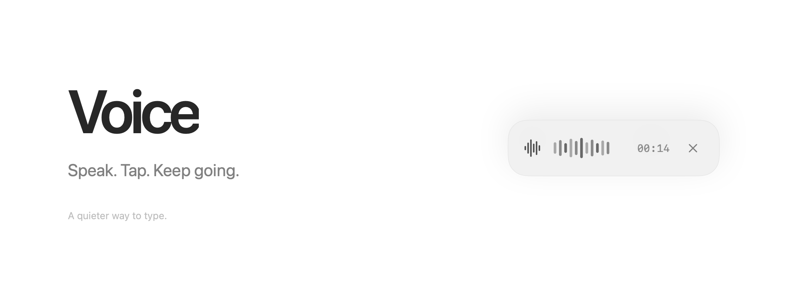
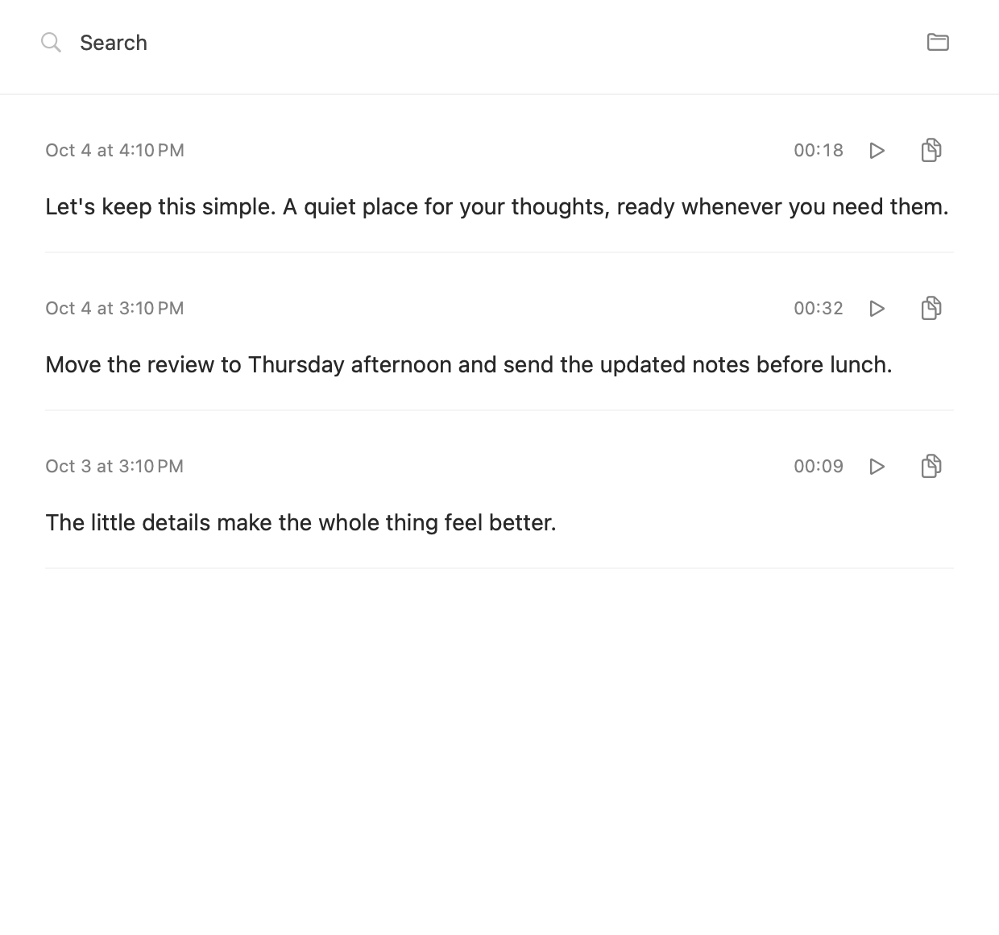
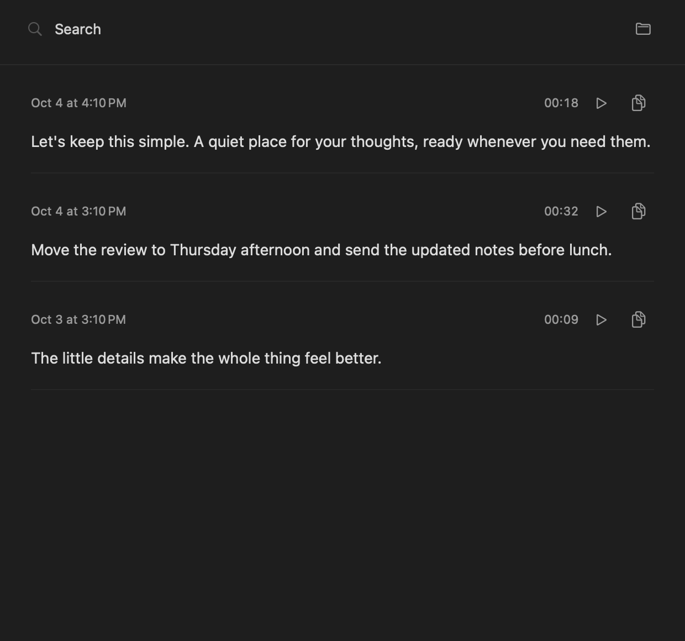

<picture>
  <source media="(prefers-color-scheme: dark)" srcset="docs/images/banner-dark.png">
  
</picture>

<p align="center">Native macOS · Bring your own key · MIT licensed</p>

Voice is a small, open-source dictation app that puts your words wherever you're already working. Press **right Option**, speak, press it again, and keep going. Your transcript arrives in the focused app while you record the next thought. No chat interface. No account with us. Just your voice, a quiet little window, and your own OpenAI key.

I built it because, for my workflow, Aqua Voice felt bulky, sluggish, and hard to customize. I wanted something beautiful, native, and entirely mine to change. Voice has no subscription of its own: you pay for the transcription API you use. Every interaction, sound, and line of Swift is yours to reshape.

## A little less, on purpose

**Stay where you are.** The recording panel never takes focus from the app you're using. A waveform, a timer, and an X are enough.

**Keep moving.** Finishing a recording immediately returns the control to idle. Transcription and paste happen in the background, in order. The next recording never waits for the last one.

**Make the details matter.** Short fades. Neutral surfaces. System typography. Two original, softly synthesized sounds: a rising opening cue and a three-note finish that lands gently.

**Leave the work visible.** Your latest 100 recordings and transcripts are kept locally. Double-tap right Option to revisit them; click a transcript to copy it.

<p align="center">
  <picture>
    <source media="(prefers-color-scheme: dark)" srcset="docs/images/recording-dark.png">
    
  </picture>
</p>

## A quiet place for your words

<picture>
  <source media="(prefers-color-scheme: dark)" srcset="docs/images/history-dark.png">
  
</picture>

<details>
<summary>Both appearances, the same restraint</summary>

| Light | Dark |
| --- | --- |
|  |  |

All screenshots use invented sample transcripts. The banner renders the actual recording component; it isn't a mockup of a different app.

</details>

## Make it yours

Requires **macOS 14 or later**, Xcode or its Command Line Tools, and an OpenAI API key with transcription access. There are no third-party runtime dependencies.

```zsh
git clone https://github.com/lukejagg/voice.git ~/Projects/Voice
cd ~/Projects/Voice
./build.sh
open build/Voice.app
```

Keep your key **outside the checkout**, in `~/secrets/openai.env`:

```dotenv
export OPENAI_API_KEY="your-api-key"
```

Protect that directory and file with `chmod 700 ~/secrets` and `chmod 600 ~/secrets/openai.env`. Voice reads this file directly, including when launched from Finder. Never commit your key.

The first launch offers **Microphone**, **Accessibility**, and **Input Monitoring** permissions. Enable Voice in System Settings → Privacy & Security. If macOS asks, quit and reopen afterward.

| Gesture | Action |
| --- | --- |
| Right Option | Start or finish recording |
| Double-tap right Option | Open history |
| Click a transcript | Copy it |
| X on the recording panel | Quit Voice |

A rapid finish → start is treated as two recording actions, not a double-tap. To open history from idle, double-tap; the tentative recording from its first tap is discarded.

Want it ready when you log in?

```zsh
python3 Scripts/login_startup.py enable
```

Disable with `python3 Scripts/login_startup.py disable`. Login startup opens the app quietly and honors the single-instance guard; quitting leaves it closed until you launch it again or next log in.

## Under the surface

| Layer | Choice |
| --- | --- |
| Interface | SwiftUI, AppKit, SF Symbols |
| Audio | AVFoundation · mono 24 kHz AAC recording |
| Transcription | OpenAI `gpt-transcribe` through `URLSession` |
| Shortcut & paste | Core Graphics event tap and Command-V |
| Background work | Main-actor ordered queue, independent of microphone capture |
| History | Local audio, plain text, and JSON files |
| Single instance | Atomic OS file lock |
| Sound | Original 48 kHz WAV cues synthesized with Python's standard library |

The app sends completed recordings to OpenAI for transcription. Audio and transcripts are stored in `~/Projects/Voice/History/`, with owner-only permissions. API keys stay in the separate secret file. There is no application analytics or separate Voice server. This is **not offline transcription**.

Each session retains its recording, transcript, timestamp, duration, and any error. Older sessions are removed after the latest 100, with in-flight work protected until it completes. Recording stops automatically after 20 minutes. Failed requests keep their audio for retry. Quitting cancels pending work and prevents late pastes.

Paste uses the focused app's normal Command-V behavior. Without Accessibility permission, text is copied for manual paste. Transcription latency, availability, and charges depend on OpenAI and your connection; Voice keeps capture responsive while requests finish.

### Change a detail

- **Panel and history:** `Sources/App.swift`
- **Shortcut:** `Sources/Hotkey.swift`
- **Model, retention, and key loading:** `Sources/Core.swift`
- **Background delivery:** `Sources/WorkQueue.swift`
- **Sound design:** `Scripts/design_sounds.py` → `Assets/Sounds/`

[Listen to the start cue](Assets/Sounds/record-start.wav) · [Listen to the finish cue](Assets/Sounds/record-finish.wav)

```zsh
./test.sh       # Logic, API mocks, overlapping work, paste order, and cancellation
./preview.sh    # Screenshots with sample data; no microphone or API calls
```

Quit before rebuilding. Builds are locally ad-hoc signed; this repository currently distributes source, not a notarized installer. Development notes and the design contract live in [AGENTS.md](AGENTS.md).

---

[MIT](LICENSE). Small by design. Yours to change.
