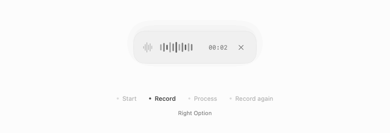

<p align="center"><strong>Dictation that leaves room for your thoughts.</strong></p>
<p align="center">
  <a href="#how-it-works">Overview</a> ·
  <a href="#design-principles">Design</a> ·
  <a href="#getting-started">Get started</a>
</p>

Voice turns spoken thoughts into writing, with as little interruption as possible. It exists for people who want dictation to feel like a natural part of their work: immediate, quiet, and entirely theirs to change.

I built it after finding Aqua Voice too bulky, slow, and difficult to customize for my workflow. I wanted a smaller, more considered tool, with the freedom to shape every detail.

## How it works

Press **right Option** to record. Speak, then press it again to finish. Voice transcribes your recording and pastes the text into the app you're using. You can start your next recording immediately while the previous one processes in the background.

Double-tap right Option from idle to open your history. Your latest 100 recordings and transcripts stay available locally, ready to replay or copy.

## Design principles


<details>
<summary>View a still frame</summary>



</details>

The animation renders the actual recording component with simulated audio levels and timing. Captions describe the flow; they are outside the app's panel. During processing, the panel disappears and recording is available again.

| State | Design |
| --- | --- |
| Starting | Capture begins immediately; the panel fades in afterward. |
| Recording | A waveform, audio level, elapsed time, and close control. Focus stays in your app. |
| Processing | The panel fades away. Transcription continues in the background. |
| Continuing | The next recording starts immediately. Completed text arrives without changing its panel. |

Neutral surfaces, system typography, and short fades keep the interface quiet. Two original sound cues mark the beginning and end of capture. Light and dark appearances follow macOS; motion respects the system's Reduce Motion setting.

## Product principles

- **Responsiveness.** Network work never blocks the next recording. Results paste in submission order.
- **Ownership.** The source, interaction, and sound design are open to change. MIT licensed.
- **Simple economics.** No Voice subscription. Use your own OpenAI key and pay for API usage.
- **Recoverability.** Recordings are saved before transcription. Failed requests retain their audio for retry.
- **Clear data boundaries.** Local history, no application analytics, and no separate Voice server. Completed audio is sent to OpenAI for transcription.

## Getting started

Requires **macOS 14+**, Xcode or its Command Line Tools, and an OpenAI API key with transcription access. This is a source build; a notarized installer is not currently provided.

```zsh
git clone https://github.com/lukejagg/voice.git ~/Projects/Voice
cd ~/Projects/Voice
./build.sh
open build/Voice.app
```

Save your key outside the repository in `~/secrets/openai.env`:

```dotenv
export OPENAI_API_KEY="your-api-key"
```

Set directory permissions to `700` and file permissions to `600`. Voice reads this file directly, including when opened from Finder.

Enable **Microphone**, **Accessibility**, and **Input Monitoring** for Voice in System Settings → Privacy & Security. Quit and reopen if macOS requests it. Without Accessibility, completed text remains on the clipboard for manual paste.

| Control | Action |
| --- | --- |
| Right Option | Start or finish recording |
| Double-tap right Option from idle | Open history |
| Click a transcript | Copy it |
| X on the recording panel | Quit Voice |

A rapid finish → start is always two recording actions. An idle double-tap discards the tentative recording created by its first tap.

To start Voice at login:

```zsh
python3 Scripts/login_startup.py enable
```

Use `disable` to remove login startup, or `status` to check it. Quitting leaves Voice closed until its next launch or login.

## Technical details

Native Swift, with no third-party runtime dependencies.

| Component | Implementation |
| --- | --- |
| Interface | SwiftUI, AppKit, SF Symbols; a nonactivating recording panel |
| Audio | AVFoundation; mono 24 kHz AAC |
| Transcription | OpenAI `gpt-transcribe` via Foundation `URLSession` |
| Input and paste | Core Graphics event tap; Command-V into the focused app |
| Background work | Ordered asynchronous queue, independent of capture |
| Persistence | Local audio, text, and JSON; latest 100 sessions |
| Single instance | Atomic OS file lock |
| Sound | Original synthesized 48 kHz stereo WAV cues |

History lives in `~/Projects/Voice/History/` with owner-only permissions. In-flight sessions are protected from pruning. Recording stops after 20 minutes; quitting preserves active audio, cancels pending work, and prevents late pastes. Transcription speed, availability, and cost depend on OpenAI and your connection.

<details>
<summary>Development</summary>

| Change | File |
| --- | --- |
| Interface and recording lifecycle | `Sources/App.swift` |
| Keyboard gesture | `Sources/Hotkey.swift` |
| Model, key loading, and history | `Sources/Core.swift` |
| Background delivery | `Sources/WorkQueue.swift` |
| Sound design | `Scripts/design_sounds.py` |

```zsh
./test.sh       # API mocks, gestures, retention, overlap, and cancellation
./preview.sh    # Native UI screenshots using sample data
```

Quit before rebuilding. Local builds use ad-hoc signing. The architecture and design contract are documented in [AGENTS.md](AGENTS.md).

[Start cue](Assets/Sounds/record-start.wav) · [Finish cue](Assets/Sounds/record-finish.wav)

</details>

[MIT license](LICENSE)
